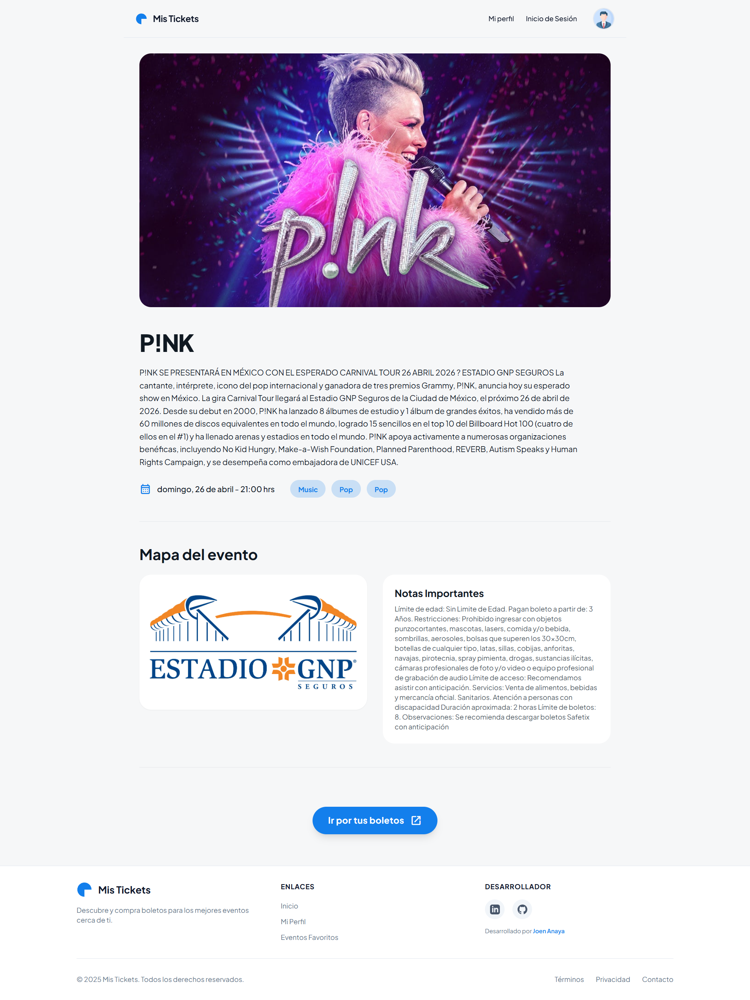
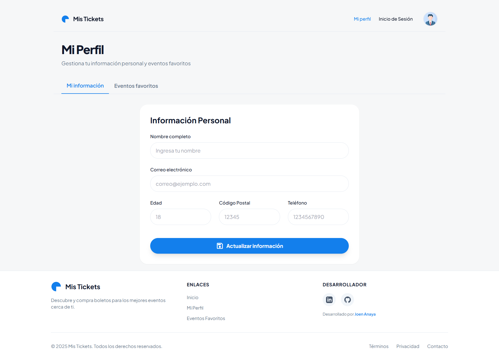
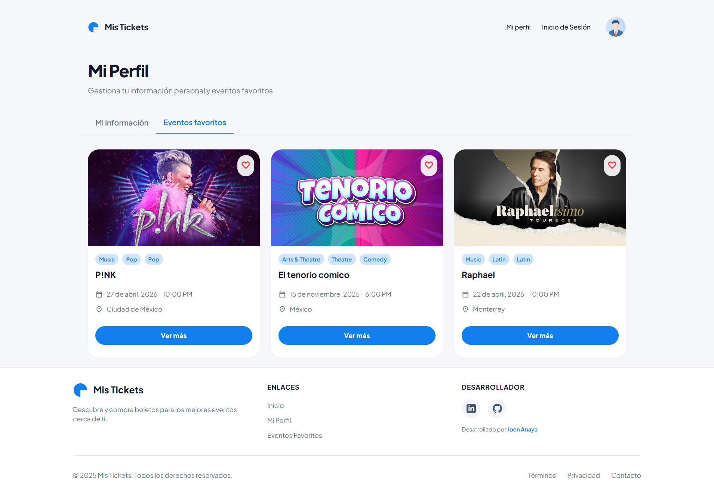
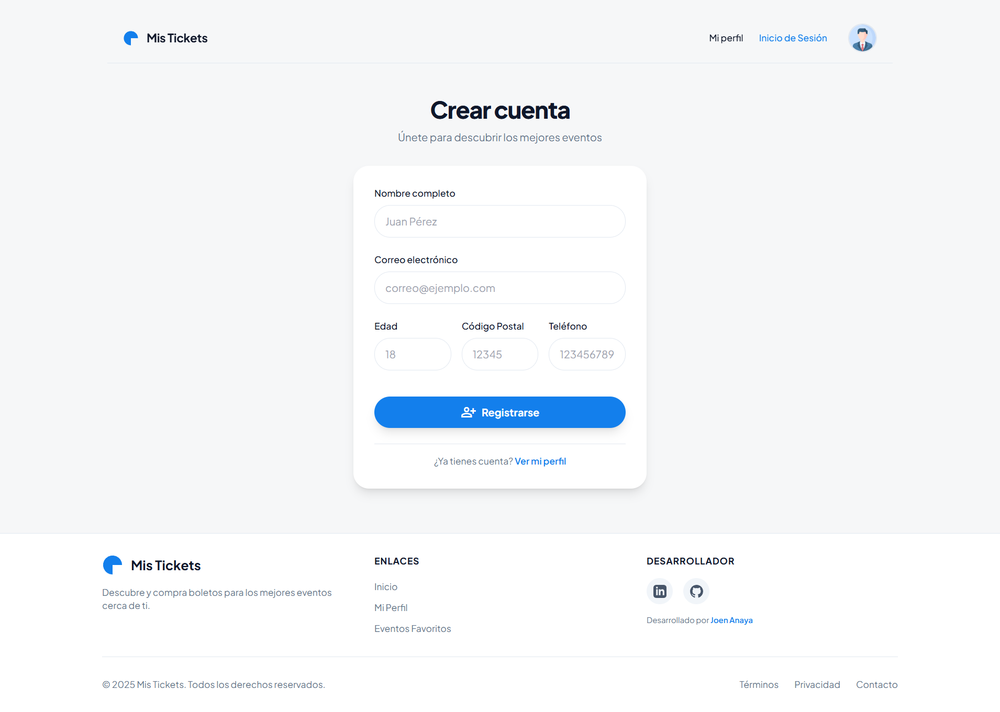

# Mis Tickets

An online ticketing web application built with React + Vite that connects to the Ticketmaster API to display events in Mexico. Users can search for events, view detailed information, and save their favorite events.


## ✨ Features

- **Event Search**: Search for events by keyword with real-time results
- **Pagination**: Navigate through multiple pages of event listings
- **Event Details**: View comprehensive event information including:
  - Event images and description
  - Date, time, and venue information
  - Seat maps (when available)
  - Price ranges
  - Genre classifications
- **Favorites**: Like/unlike events with localStorage persistence
- **User Profile**: Manage personal information and view liked events
- **Responsive Design**: Fully responsive UI with dark mode support
- **Form Validation**: User signup and profile forms with react-hook-form

## 🖼️ Screenshots

### Events Grid


### User Profile


### Favorite Events


### Sign Up


## 🚀 Tech Stack

- **Frontend Framework**: React 18.3.1
- **Build Tool**: Vite 5.2.0
- **Routing**: React Router DOM 6.23.1
- **State Management**: Zustand 4.5.2
- **Form Handling**: React Hook Form 7.51.4
- **Date Formatting**: date-fns 3.6.0
- **Pagination**: React Paginate 8.2.0
- **Styling**: CSS Modules with Tailwind-like utility classes
- **API**: Ticketmaster Discovery API v2

## 📦 Installation

1. **Clone the repository**
   ```bash
   git clone <repository-url>
   cd Mis-Tickets-main
   ```

2. **Install dependencies**
   ```bash
   npm install
   ```

3. **Set up environment variables**

   Create a `.env` file in the root directory:
   ```env
   VITE_API_BASE_URL=https://app.ticketmaster.com/discovery/v2
   VITE_API_KEY=your_ticketmaster_api_key_here
   ```

   > **Note**: Get your free API key from [Ticketmaster Developer Portal](https://developer.ticketmaster.com/)

4. **Start the development server**
   ```bash
   npm run dev
   ```

   The application will be available at `http://localhost:5173`

## 🛠️ Available Scripts

```bash
# Start development server
npm run dev

# Build for production
npm run build

# Preview production build
npm run preview

# Run ESLint
npm run lint
```

## 📁 Project Structure

```
src/
├── assets/              # Images and static files
├── components/          # Reusable components
│   ├── Events/         # Event listing components
│   ├── Navbar/         # Navigation bar
│   ├── Footer/         # Footer component
│   └── ErrorBoundary/  # Error handling
├── hooks/              # Custom React hooks
│   ├── useEventsData.js    # Event data hook
│   └── useLikeEvents.js    # Like functionality hook
├── routes/             # Route configuration
├── state/              # Zustand state management
│   └── events-results.js   # Global event store
├── utils/              # Utility functions
│   ├── fetchEvents.jsx     # API fetch utilities
│   ├── wrapPromise.js      # Suspense wrapper
│   └── constant.js         # Constants
├── views/              # Page components
│   ├── Home/           # Event listings page
│   ├── Detail/         # Event detail page
│   ├── Profile/        # User profile page
│   ├── SignupForm/     # User registration
│   └── Error404/       # 404 page
├── App.jsx             # Root component
└── main.jsx            # Application entry point
```

## 🏗️ Architecture Highlights

### State Management
- **Zustand** is used for global state management instead of Context API or Redux
- Global store manages event data, loading states, and errors
- Custom hooks provide clean interfaces to the store

### Data Fetching Patterns
1. **Zustand + Async Actions** (Home page)
   - Centralized API calls for event listings
   - Search and pagination support

2. **React Suspense + Promise Wrapper** (Detail page)
   - Custom `wrapPromise` utility for Suspense compatibility
   - Lazy loading of event details

### Routing
- `/` - Home page with event listings
- `/detail/:eventId` - Event detail page
- `/profile` - User profile (nested routes)
  - `/profile/my-info` - User information
  - `/profile/liked-events` - Favorite events
- `/sign-up` - User registration

### Local Storage
- Liked events are persisted using localStorage
- Key: `"likedEvents"` (array of event IDs)

## 🌐 API Integration

The application integrates with the **Ticketmaster Discovery API v2**:

- **Base URL**: `https://app.ticketmaster.com/discovery/v2`
- **Endpoints Used**:
  - `GET /events.json` - List events with search/pagination
  - `GET /events/{id}` - Get event details
- **Query Parameters**:
  - `apikey` - Authentication key
  - `countryCode=MX` - Filter events in Mexico
  - `keyword` - Search term
  - `page` - Pagination
  - `embed=venues` - Include venue details

## 🎨 Styling

- **CSS Modules** for component-scoped styling
- Utility-first CSS approach (Tailwind-like classes)
- Dark mode support throughout the application
- Responsive design for mobile, tablet, and desktop

## 🔒 Environment Variables

| Variable | Description | Required |
|----------|-------------|----------|
| `VITE_API_BASE_URL` | Ticketmaster API base URL | Yes |
| `VITE_API_KEY` | Your Ticketmaster API key | Yes |

## 📝 License

This project is for educational purposes.

## 🤝 Contributing

Contributions, issues, and feature requests are welcome!

## 👨‍💻 Author

Created with ❤️ using React and Vite

---

**Status**: ✅ Completed
